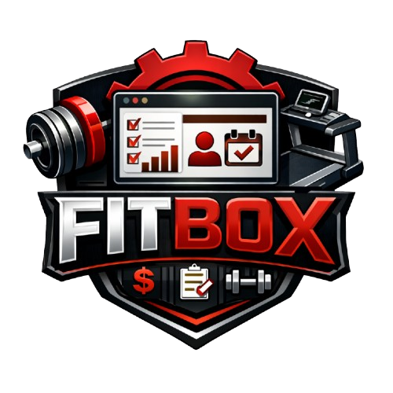

<div align="center">
  
  <h1>FITBOX</h1>
  <p><strong>Plataforma integral de gestión, acceso y control para centros deportivos modernos.</strong></p>
  
  
  
  
  
  
</div>

---

**Autor:** Alberto García Izquierdo  
**Tutor:** Francisco José Mera Calderón  
**Curso:** 2º DAW - IES Albarregas (2025/2026)  
**Estado del Proyecto:** 🟢 En Desarrollo Activo

---

## 💡 El Problema y Nuestra Solución

Actualmente, los gimnasios de tamaño pequeño y mediano (como los boxes de Crossfit o centros de artes marciales) se enfrentan a un problema: las soluciones de software del mercado son demasiado caras, complejas o están anticuadas. Muchos siguen recurriendo a hojas de cálculo en Excel, cobros en efectivo descontrolados y tarjetas de acceso físicas que los socios pierden constantemente.

**FITBOX** nace como una solución integral, alojada 100% en la nube (SaaS), que digitaliza y automatiza las tareas diarias del centro deportivo. Su diseño **Mobile-First**, su interfaz en **Modo Oscuro (Dark UI)** y la **Nnternalización (i18n)** de la página garantizan una experiencia de usuario premium tanto para el dueño del negocio como para el cliente final.

## 👥 Perfiles de Usuario 

El sistema utiliza un Control de Acceso Basado en Roles para ofrecer una interfaz única a cada usuario:

1. 👑 **Administrador:** Tiene control absoluto. Gestiona las finanzas, da de alta/baja a usuarios, crea los horarios semanales y visualiza las analíticas de ingresos y aforos.
2. 🏋️ **Monitor:** Su interfaz está orientada a la operativa diaria. Puede ver las clases que imparte, pasar lista de los asistentes y reportar averías en la maquinaria del centro con un solo clic.
3. 🏃 **Socio:** Interfaz enfocada al uso móvil. Permite reservar clases en un par de toques, comprobar el estado de sus pagos y generar un **Código QR dinámico** para abrir el torno del gimnasio.

## ✨ Módulos y Funcionalidades Principales

- **Módulo de Acceso:** Sustitución de las tarjetas físicas por un sistema de Código QR único vinculado al perfil del socio, validado en tiempo real.
- **Módulo de Reservas:** Calendario interactivo con control de aforos. Impide reservar si la clase está llena o si el socio tiene recibos impagados.
- **Módulo de Mantenimiento:** Sistema ágil de tickets internos. Si una cinta de correr falla, el monitor la marca como "En reparación" y el administrador recibe el aviso.
- **Módulo Financiero:** Control del estado de las cuotas (Pagado / Pendiente) mediante un sistema visual de semáforos y resumen de ingresos mensuales.
- **Autenticación Segura:** Sistema de login robusto con encriptación de contraseñas y recuperación de cuentas vía email.

## ⚙️ Arquitectura Técnica

FITBOX está diseñado como una **Single Page Application** de alto rendimiento:

- **Frontend Reactivo:** Construido con **React 19** y **TypeScript** para garantizar la seguridad de tipado y evitar errores en tiempo de ejecución.
- **Estilizado Moderno:** Uso de **Tailwind CSS v4** con una arquitectura orientada a utilidades, prescindiendo de archivos CSS tradicionales y garantizando una UI responsiva.
- **Backend as a Service (BaaS):** Delegación de la base de datos, la autenticación y el almacenamiento en **Supabase** (PostgreSQL).
- **Seguridad de Datos:** Implementación estricta de **Row Level Security (RLS)** directamente en la base de datos para garantizar que ningún usuario pueda acceder o modificar datos que no le corresponden, incluso si se interceptan las peticiones.

## 📁 Estructura del Proyecto

El proyecto está construido con React, Vite y TypeScript, siguiendo una arquitectura modular orientada a la escalabilidad:

```text
FITBOX/
 ├── docs/
 ├── public/
 ├── src/
 │    ├── assets/
 │    ├── components/
 │    ├    ├── charts
 |    |    ├── common
 |    |    ├── forms
 |    |    ├── ui
 |    |    └── utils
 │    ├── database/
 |    |    ├── repositories
 │    │    └── supabase/
 │    │         └── Client.ts
 |    ├── hooks
 │    ├── interfaces/
 │    ├── layouts/
 │    ├── locales/
 │    ├── pages/
 │    ├── router/
 │    ├── stores/
 |    ├── styles
 |    |      └── index.css
 |    ├── types
 |    ├── utils
 │    ├── App.tsx
 │    └── main.tsx
 ├── .env
 ├── package.json
 ├── tailwind.config.js
 └── vite.config.ts
```
