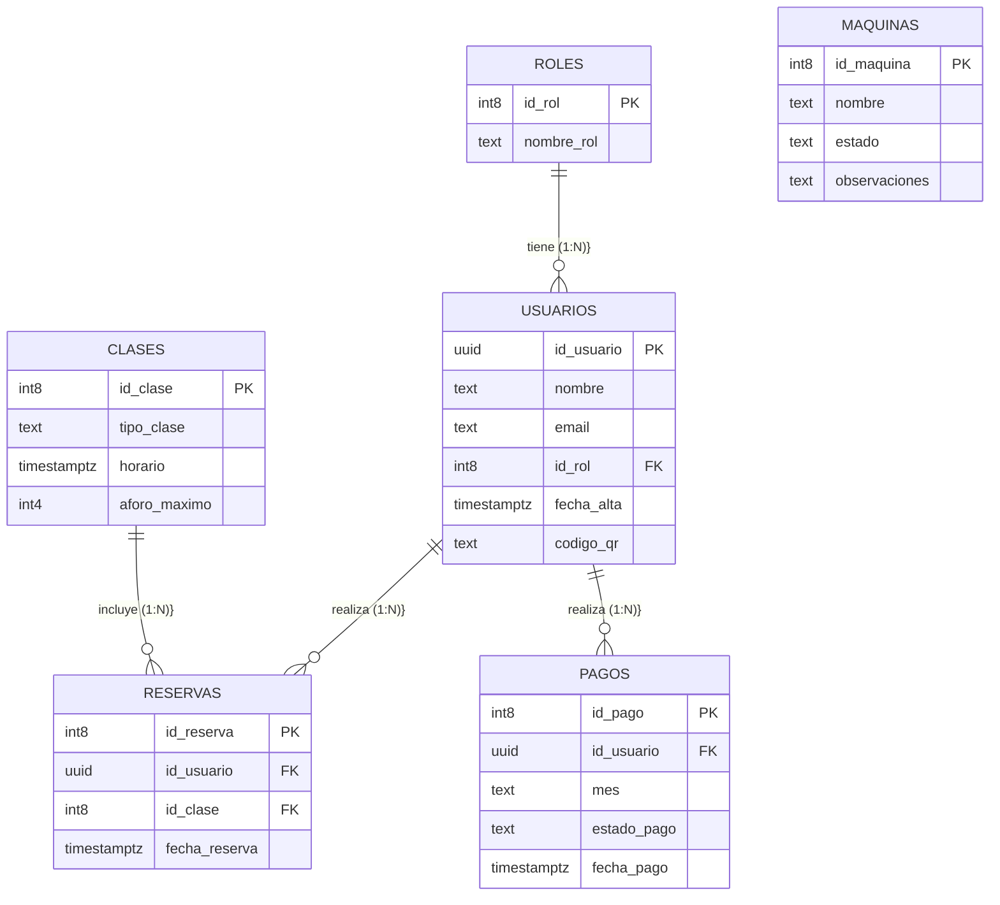

# ⚙️ Manual Técnico

Este documento detalla la arquitectura, el stack tecnológico y la estructura de datos que hacen funcionar a FITBOX.

## 1. Requisitos del Sistema

### Requisitos Funcionales

- El sistema debe permitir el registro y autenticación de usuarios.
- Debe existir un CRUD (Crear, Leer, Actualizar, Borrar) para gestionar clases, usuarios y máquinas.
- Los socios deben poder reservar plaza en las clases sin superar el aforo máximo.
- El acceso físico debe estar vinculado a la generación de un código QR único por usuario.

### Requisitos No Funcionales

- **Responsive:** La interfaz debe ser "Mobile First", adaptable a cualquier pantalla.
- **Seguridad:** Las contraseñas se almacenan encriptadas y el acceso a datos se rige por políticas RLS (Row Level Security).
- **Rendimiento:** Al ser una SPA (Single Page Application), la navegación debe ser instantánea sin recargas completas de página.

### Roles y Permisos

- **Socio:** Permisos de lectura sobre clases e inserción sobre sus propias reservas.
- **Monitor:** Lectura de clases asignadas y actualización de estado de máquinas.
- **Administrador:** Control total (CRUD completo) sobre todas las tablas de la base de datos.

## 2. Tecnologías

Se ha optado por un stack moderno muy demandado en el sector tecnológico actual:

- **Frontend:** React + Vite (para una compilación y desarrollo ultrarrápidos) y Tailwind CSS para unos estilos limpios y modulares.
- **Backend y Autenticación:** Supabase. Actúa como Backend-as-a-Service, ofreciendo autenticación segura lista para usar.

## 3. Base de Datos

Utilizamos una base de datos relacional PostgreSQL (alojada en Supabase). Las entidades principales son:

- `usuarios`: Almacena el perfil, el ID de rol y el código QR.
- `clases`: Define el tipo de actividad, fecha, hora y aforo máximo.
- `reservas`: Tabla intermedia que relaciona usuarios con clases.
- `maquinas`: Inventario y control de estados (Operativa / Rota).
- `pagos`: Histórico de cuotas por usuario.

### 3.1. Diagrama Entidad-Relación

A continuación se detalla el Modelo Entidad-Relación de la base de datos de FITBOX, generado dinámicamente. Este modelo garantiza la integridad referencial conectando a los usuarios con sus roles, reservas y pagos:

